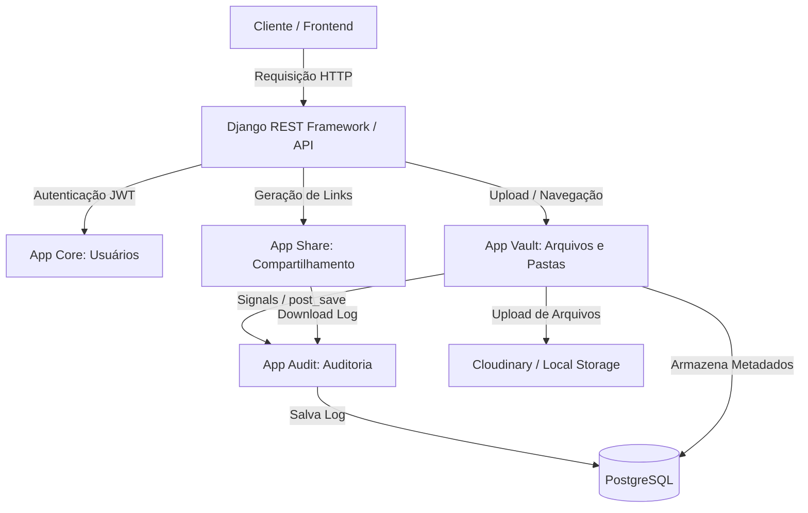

# Arquitetura do Sistema - Nexus

Esta página detalha os componentes fundamentais, fluxos de requisição e os padrões de projeto (Design Patterns) adotados no Nexus.

## Visão Geral da Arquitetura

O Nexus utiliza uma arquitetura baseada no padrão de arquitetura do Django (MVT/MTV), adaptado para uma arquitetura de API RESTful usando **Django REST Framework (DRF)**.

## Padrões de Projeto Aplicados (Design Patterns)

### 1. Active Record (Modelos Django)
Cada modelo no sistema encapsula os dados e as operações de banco de dados diretamente.
* Exemplo: [File](file:///c:/Users/Ativos/Documents/nexus/Nexus/vault/models.py#L46) estende `models.Model` e sobrescreve o método `save()` para preencher automaticamente metadados como tamanho, tipo MIME e nome original do arquivo.

### 2. Service Layer (Camada de Serviços)
Funções que realizam lógica de negócio complexa ou externa são isoladas em serviços focados para manter views e models enxutos.
* Exemplo: O serviço de compactação [compress_file](file:///c:/Users/Ativos/Documents/nexus/Nexus/vault/services.py#L7) isola a manipulação binária em memória do arquivo ZIP.

### 3. Observer (Django Signals)
Usado para desacoplar a criação de logs de auditoria das ações principais de modificação de dados.
* Exemplo: O arquivo [signals.py](file:///c:/Users/Ativos/Documents/nexus/Nexus/audit/signals.py#L58-L72) escuta alterações (`post_save`, `post_delete`) nos modelos `File` e `Folder` para gravar registros na tabela de `Audit` de forma assíncrona lógica.

### 4. Middleware
Utilizado para capturar informações contextuais de cada requisição HTTP de forma global.
* Exemplo: [AuditMiddleware](file:///c:/Users/Ativos/Documents/nexus/Nexus/audit/middleware.py#L10) captura o objeto `request` atual e o armazena em uma variável de thread local para que os Signals de auditoria tenham acesso ao usuário autenticado e IP de origem da ação.

### 5. Generic Relations (Polimorfismo de Banco de Dados)
Permite que o registro de auditoria aponte para qualquer objeto de qualquer modelo do Django sem a necessidade de múltiplas chaves estrangeiras nulas.
* Exemplo: A classe [Audit](file:///c:/Users/Ativos/Documents/nexus/Nexus/audit/models.py#L8) usa `ContentType` e `GenericForeignKey` para se associar dinamicamente a `File`, `Folder`, `SharedLink` ou qualquer outro recurso.
